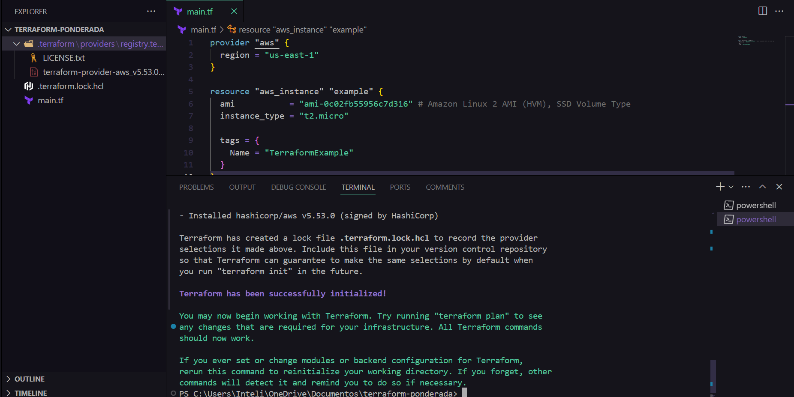
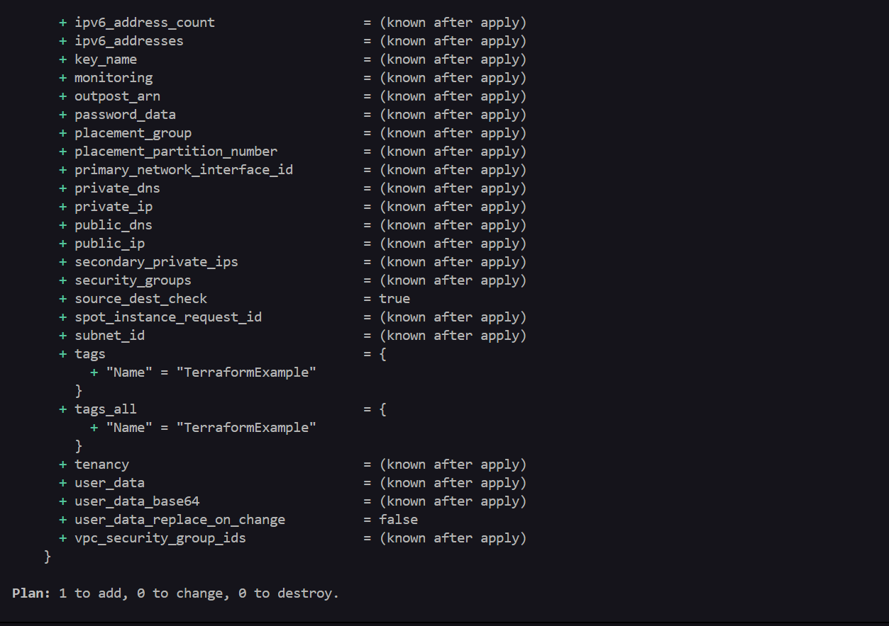
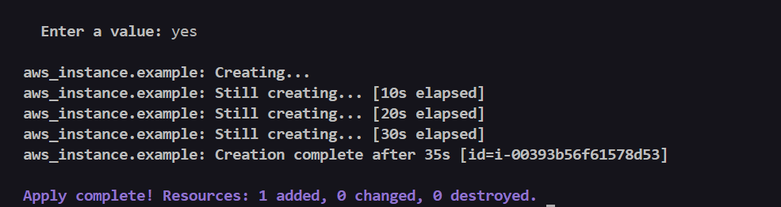
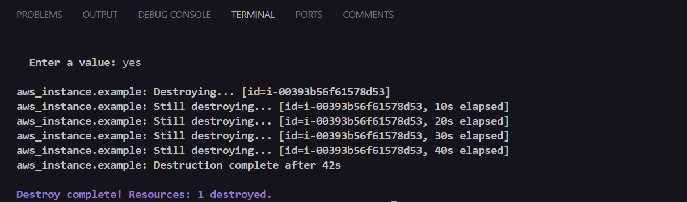

# Infraestrutura como Código no Windows

## Pré-requisitos

Para realizar o tutorial, precisa-se de uma conta no <a href="https://aws.amazon.com/pt/training/awsacademy/"> AWS Academy </a>

## Instalando o Terraform CLI

Siga os passos abaixo para instalar o Terraform CLI no Windows usando PowerShell:

1. Abra o PowerShell como Administrador.

2. Baixe o Terraform executando o comando:

``` 
Invoke-WebRequest -Uri https://releases.hashicorp.com/terraform/1.0.11/terraform_1.0.11_windows_amd64.zip -OutFile terraform.zip
```

3. Extraia o arquivo ZIP:

```
Expand-Archive -Path terraform.zip -DestinationPath C:\terraform
```

4. Adicione o Terraform ao PATH do sistema:

```
[System.Environment]::SetEnvironmentVariable('PATH', $env:PATH + ';C:\terraform', [System.EnvironmentVariableTarget]::Machine)
```

5. Verifique a instalação executando:

```
terraform -v
```

## Instalando o AWS CLI:

Siga os passos abaixo para instalar o AWS CLI no Windows usando PowerShell:

1. Baixe e execute o instalador AWS CLI MSI para Windows (64 bits):

<center>https://awscli.amazonaws.com/AWSCLIV2.msi</center>

2. Você também pode executar o comando msiexec para executar o instalador MSI:

```
msiexec.exe /i https://awscli.amazonaws.com/AWSCLIV2.msi
```

3. Para confirmar a instalação, abra o menu Início, procure por `cmd` para abrir uma janela do prompt de comando e, no prompt de comando, use o comando:

```
aws --version
```

Você deve ver algo como:

```
aws-cli/2.15.30 Python/3.11.6 Windows/10 exe/AMD64 prompt/off
```

## Configurando as Credenciais da AWS

1. Configure suas credenciais da AWS executando o comando:

```
aws configure
```

Forneça suas credenciais de acesso (AWS Access Key ID, AWS Secret Access Key, região padrão e formato de saída).

2. Em seguida, configure o AWS Access Token diretamente no arquivo de credenciais:

- Abra o PowerShell e navegue até o diretório de configuração da AWS:

```
cd ~\.aws\
```

- Abra o arquivo credentials em um editor de texto:

```
notepad credentials
```

- Adicione ou edite a seção com o seguinte conteúdo:

```
[default]
aws_access_key_id = YOUR_ACCESS_KEY_ID
aws_secret_access_key = YOUR_SECRET_ACCESS_KEY
aws_session_token = YOUR_SESSION_TOKEN
```

## Criando uma Instância EC2 com Terraform

1. Crie uma pasta no seu local de preferência e dentro dela, crie um arquivo de configuração Terraform chamado main.tf com o seguinte conteúdo:


```hcl
provider "aws" {
  region = "us-east-1"
}

resource "aws_instance" "example" {
  ami           = "ami-0c02fb55956c7d316"  # Amazon Linux 2 AMI (HVM), SSD Volume Type
  instance_type = "t2.micro"

  tags = {
    Name = "TerraformExample"
  }
}

```

2. Abra o PowerShell no diretório onde está o arquivo main.tf e execute os comandos na ordem a seguir:

``` terraform init ``` -  Inicializa o diretório de trabalho do Terraform, instalando os provedores necessários e configurando o backend.



```  terraform plan ``` - Cria um plano de execução, mostrando quais ações o Terraform realizará ao aplicar o que está definido nos arquivos de configuração.



``` terraform apply ``` - Aplica as mudanças necessárias para alcançar o estado desejado da configuração.



Para destruir os recursos que foram criados, pode-se executar o seguinte comando:

``` terraform destroy ```

Digite yes quando solicitado para confirmar a destruição da infraestrutura:




